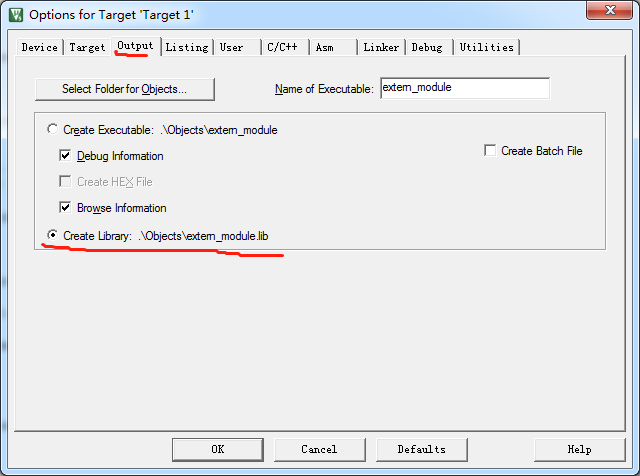
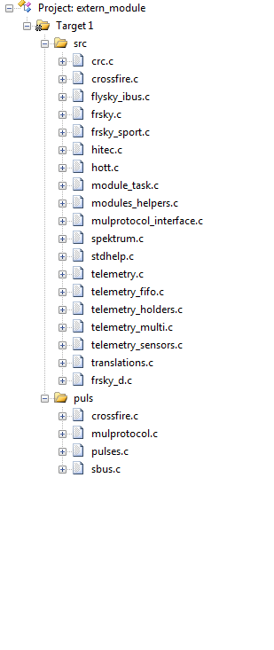
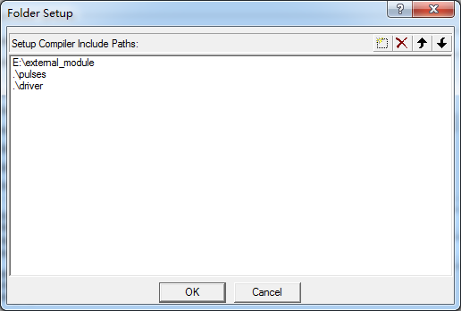

======================
利用keil生成lib
======================

**参考链接** 
http://www.keil.com/support/man/docs/uv4/uv4_ca_createlibraryfile.htm

利用keil生成外部模块库
======================

把那些文件封装成lib?
-----------------------

一般来说把与平台无关的代码封装成为lib，对于extern_module我们把除了driver目录下
的文件都封装称为lib。

如何利用keil生成外部模块库
---------------------------------

- 打开keil

- 新建工程，我们把工程目录定位到外部模块文件夹，把工程命名为extern_module,这个
也是工程输出目标文件的名称。

- Option->Output 选择 Creat Library 如下图可以看到库文件为extern_mudule.lib,
  输出路径为工程目录下的objects/

- 把需要生成lib的文件添加到工程，如下图

- Option->C/C++->Include Paths 添加头文件目录，如下图

- 编译程序

- 在工程的Objects/目录下可以看到 extern_module.lib