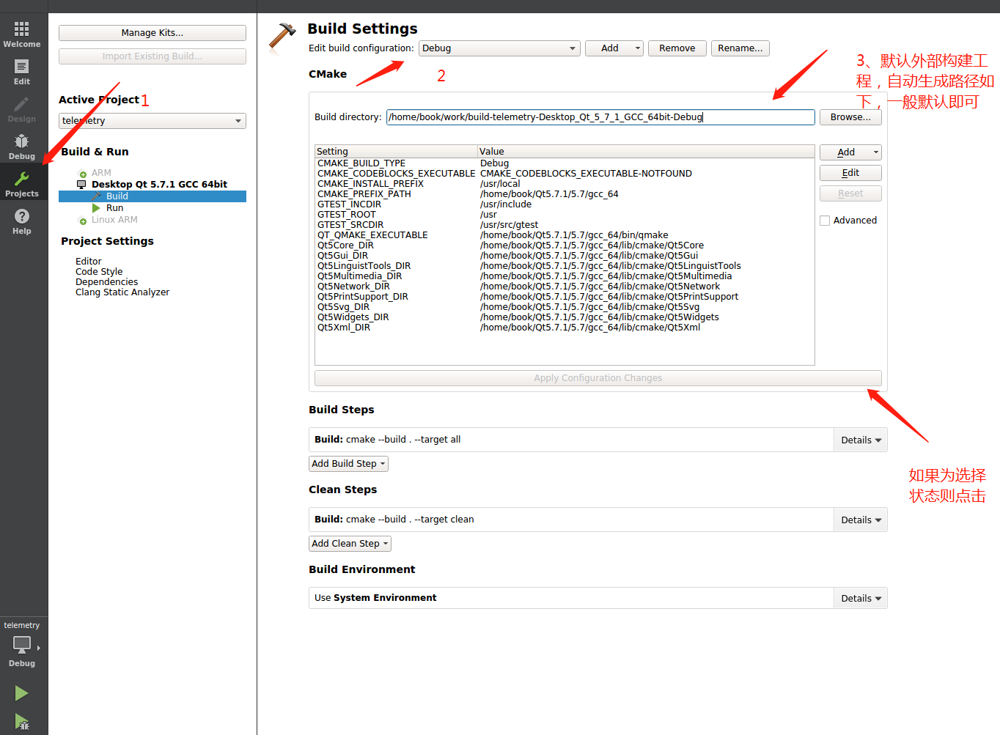
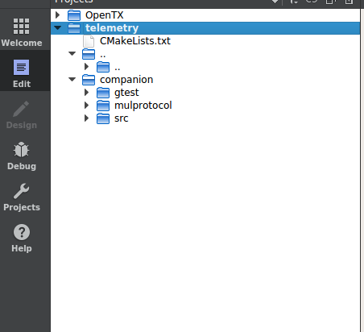
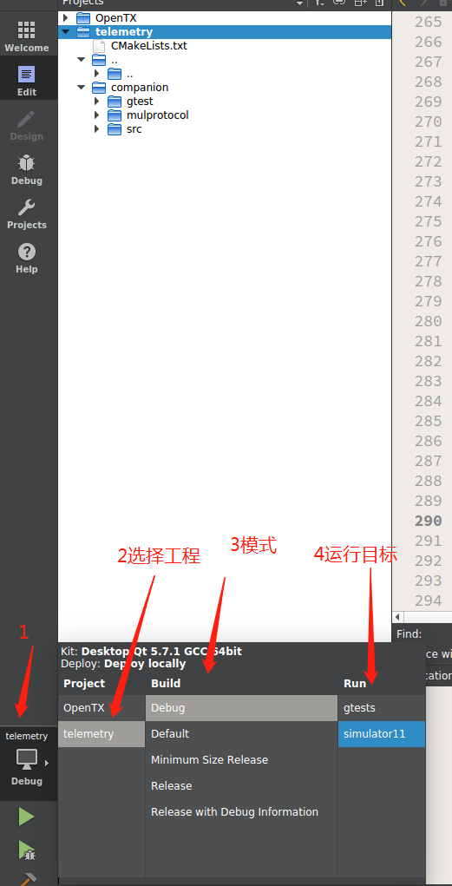

===============
TODO
===============

Installation
==============

工程没有上传到远程库，工程的源码路径如下：

.. code-block::

  /home/book/work/telemetry

Getting started
==================

Qt creator下运行工程
------------------------

#. 打开 Qt creator

#. Open Project-> 选择打开工程目录下的CMakeLists.txt

#. 转到工程目录下选择工程->右键->Run cmake

#. 选择工程、build、运行目标

#. 快捷键Ctrl+B编译工程

#. 快捷键Ctrl+R运行

命令行下运行gtest
------------------
在构建完工程后，可以在工程的编译路径下运行gtest，当然也可以在Qt creator

#. 打开编译目录

.. code-block::

  cd /home/book/work/build-telemetry-Desktop_Qt_5_7_1_GCC_64bit-Debug

#. 编译gtest

.. code-block::

  make gtests

#. 执行gtest

.. code-block::

  ./gtests
